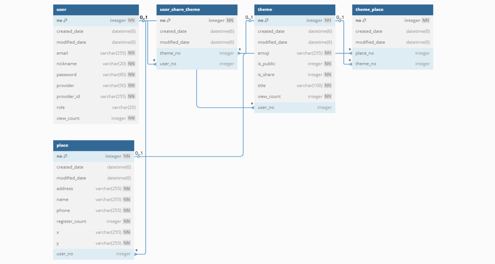
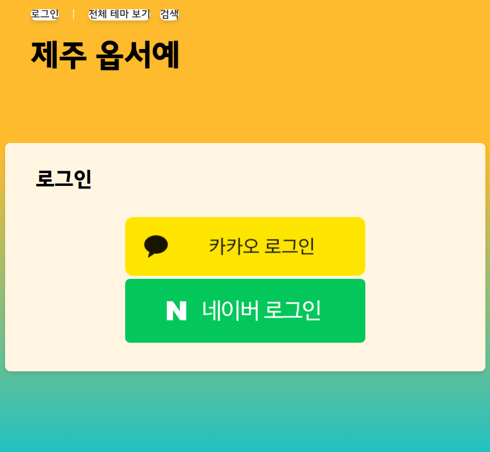
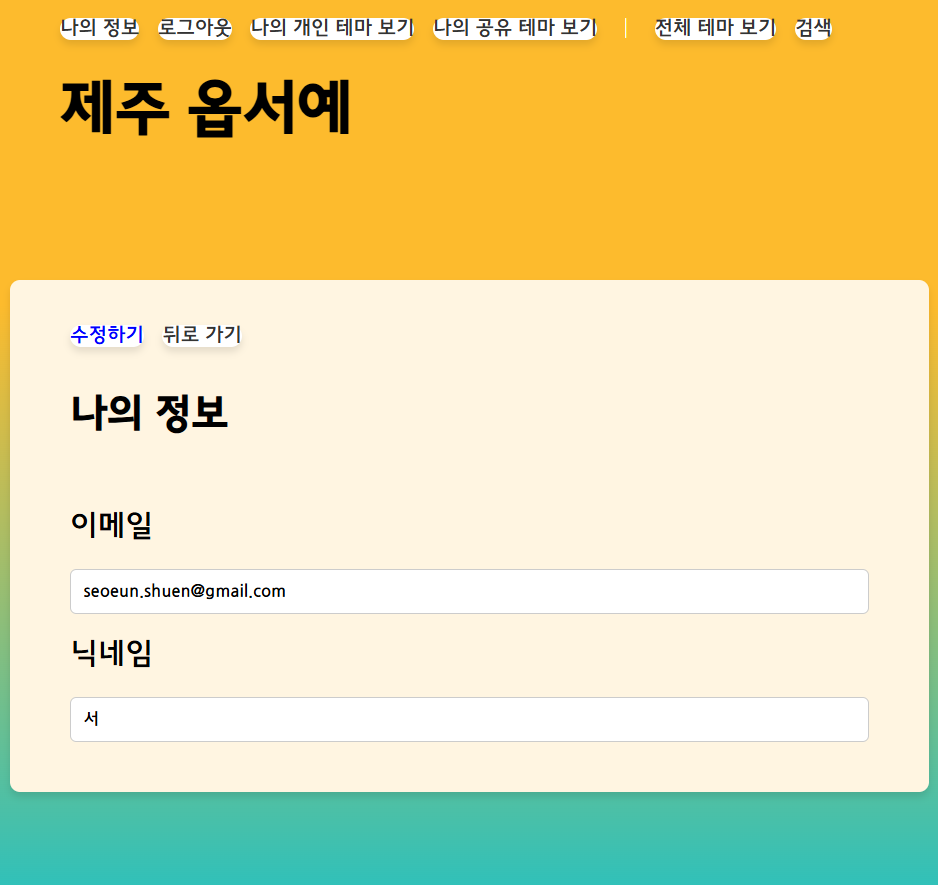
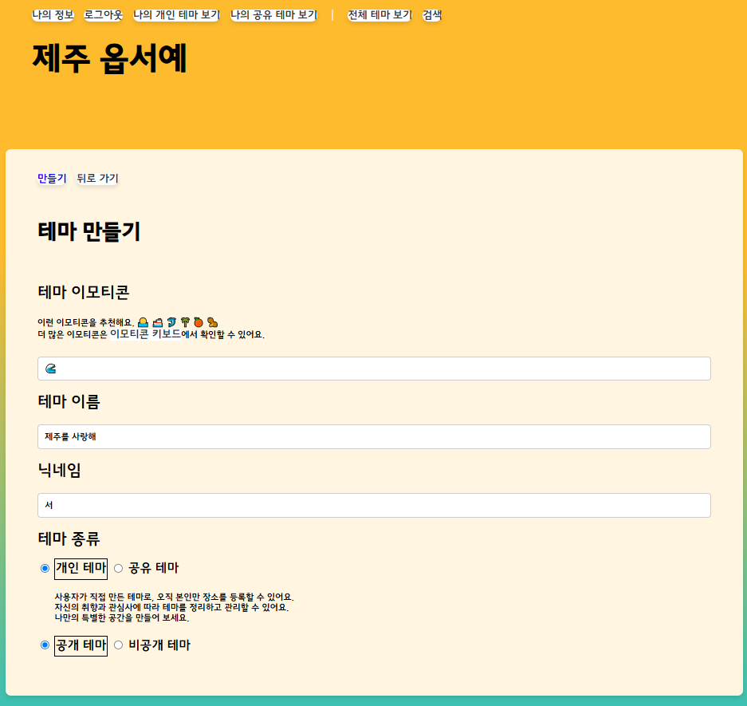
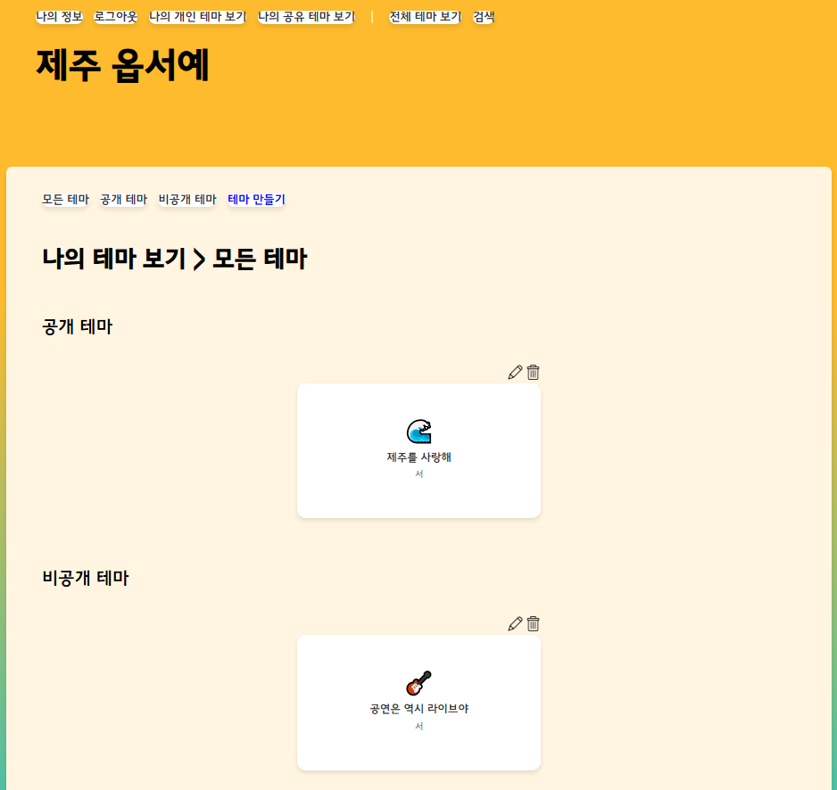
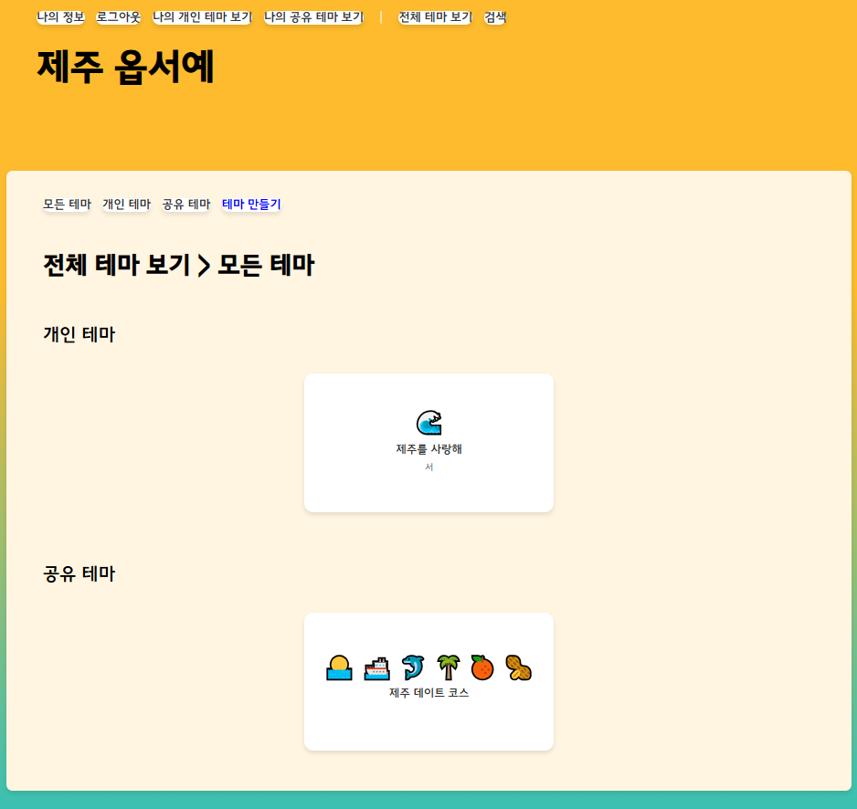
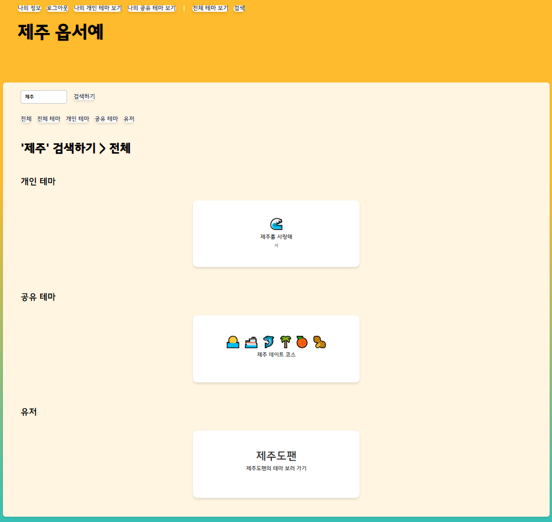
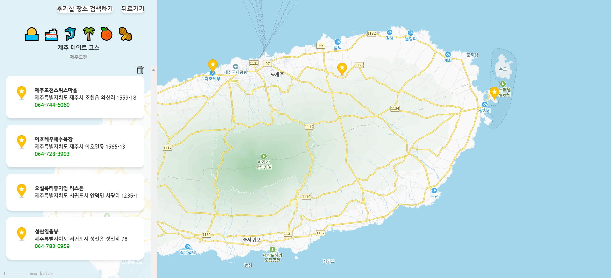
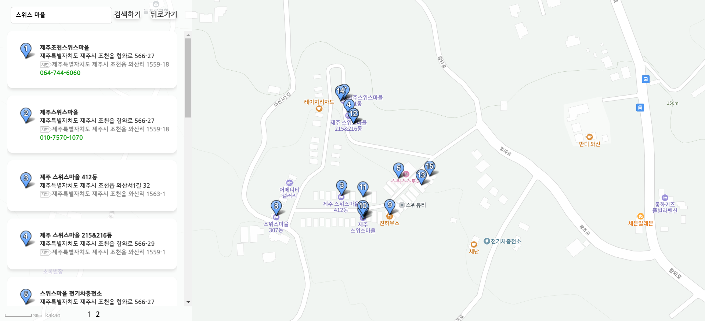

# Welcome to JEJU
<b>Welcome to JEJU(제주 옵서예)</b>는 사용자가 제주도 여행지를 테마별로 공유하고 추천받을 수 있는 참여형 웹 프로젝트입니다. 
기존의 획일적인 관광 정보 제공 방식에서 벗어나 사용자의 경험과 취향을 반영한 맞춤형 여행 정보를 제공합니다. 
사용자는 자신만의 제주 여행 경험을 테마로 구성하여 공유할 수 있으며 이를 통하여 보다 다양한 여행 스타일과 추천 정보를 발견할 수 있습니다.

 

### 사용 기술
|||
|-|-|
|**Back-End**|Java, Spring Boot, Spring Security, Spring Data JPA, Thymeleaf, MySQL|
|**Front-End**|JavaScript, HTML/CSS|
|**API**|OAuth2.0 (Kakao, Naver), Kakao Maps API|

 

### 데이터베이스 모델링

 

### 구현 기능
- **로그인, 로그아웃**
    - Spring Security를 활용한 인증 구현
    - 카카오, 네이버 소셜 로그인 연동 및 OAuth2.0 인증 구현

|||
|-|-|
|▽ 로그인|▽ 나의 정보|
|||

 

- **테마 관리**
    - 테마 생성, 조회(목록), 수정, 삭제 기능 구현

|||
|-|-|
|▽ 테마 생성|▽ 나의 테마 조회(목록)|
|||
|▽ 전체 테마 조회(목록)|▽ 검색|
|||

 

- **장소 관리**
    - 테마별 장소 등록 및 삭제 기능 구현
    - 카카오 지도 API를 활용한 장소 검색 및 위치 정보 시각화

||
|-|
|▽ 장소 조회(목록)|
||
|▽ 장소 검색|
||
