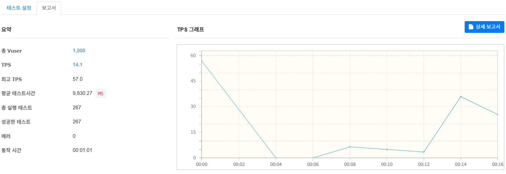
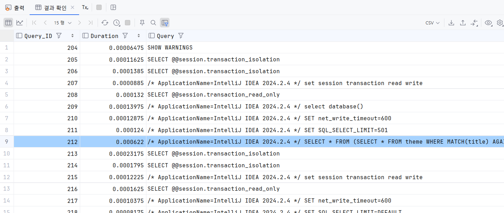
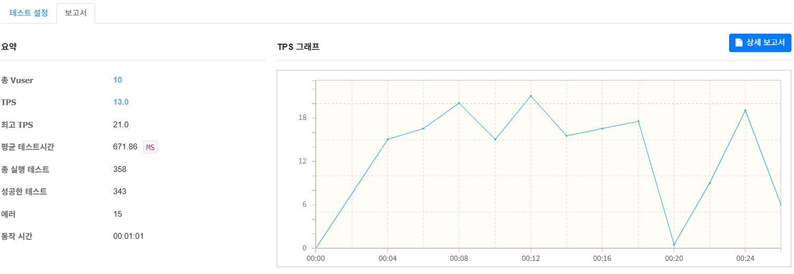

# Welcome to JEJU(제주 옵서예)
사용자가 테마별로 제주도 여행지를 공유하고 추천받으며 개인의 경험과 취향을 반영한 여행 정보를 제공하는 참여형 웹 프로젝트 [`(🔗 배포 주소)`](http://3.37.97.49:8080/)

 

## 기술 스택
|  |  |
| --- | --- |
| **Back-End** | Java, Spring Boot, Spring Security, Spring Data JPA, Thymeleaf, MySQL, Redis (Redis Cloud) |
| **Front-End** | JavaScript, HTML/CSS |
| **API 연동** | OAuth 2.0 (Kakao, Naver), Kakao Maps API |
| **Messaging & Real-time** | Redis (Pub/Sub), SSE(Server-Sent Events) |
| **Deployment** | AWS EC2 (Ubuntu), RDS (MySQL) |

 

## 데이터베이스 모델링

 

## 구현 기능
### 메인
- 메인 페이지에서 인기 유저, 테마, 장소 데이터를 조회하는 로직을 동기 방식에서 `CompletableFuture`를 활용한 비동기 방식으로 변경하고, 캐싱을 적용하여 조회 성능을 개선하였습니다. 
비동기 처리 과정에서 지연 로딩(LAZY) 관계에 접근할 수 있도록 `@Transactional(readOnly = true)`를 사용하여 트랜잭션 범위를 명시하고, 성능 테스트와 AWS 모니터링 지표를 바탕으로 데이터 병렬 처리 과정에서 발생할 수 있는 스레드 병목 현상을 방지하기 위하여 CPU 코어 수 기반으로 스레드 수를 계산하여 `newFixedThreadPool(availableProcessors() + 1)`을 적용하였습니다.
    - **수치 변화**
        - 실행 시간 : { 377 } ms ⇒ { 144 } ms **(약 61.8% 개선)**
    - **nGrinder를 사용한 성능 측정 및 수치 변화**
        - 평균 TPS : { 7.0 } ⇒ { 18.9 }  **(약 2.7배 향상)**
        - 최고 TPS : { 9.5 } ⇒ { 36.5 }
        - 평균 테스트 시간 : { 1,433.93 } ms ⇒ { 597.90 } ms
        - 총 실행 테스트 : { 226 } ⇒ { 687 }
            |  |  |
            | --- | --- |
            | Before |  |
            | After |  |

 

### 인증/인가
- Spring Security를 활용한 인증 구현
- OAuth 2.0 인증 구현 및 카카오, 네이버 소셜 로그인 연동

 

 

- 다중 소셜 로그인 연동 시 서로 다른 응답 구조 차이를 해결하였습니다. 
로그인 한 사용자 이메일이 데이터베이스에 존재하지 않는 경우 OAuth 2.0 인증 기반 자동 회원 가입 로직을 구현하는 과정에서 소셜 로그인 제공자별 응답 구조 차이를 확인하고, Adapter 패턴과 Strategy(전략) 패턴을 학습하고 적용하였습니다. 
    - **Adapter 패턴** : 소셜 로그인 제공자별로 공통 인터페이스를 구현한 클래스를 정의하여 상이한 응답 구조를 통일된 사용자 정보 형식으로 변환
    - **Strategy(전략) 패턴** : 소셜 로그인 제공자에 따라 적절한 사용자 정보 변환 전략을 동적으로 선택하도록 구성하여 새로운 제공자 추가 시 전략 객체만 등록하면 되는 유연하고 확장 가능한 구조로 설계

 

- 소셜 로그인 시 사용자 정보를 조회하는 과정에서 카디널리티 수치가 높은 email 컬럼에 단일 인덱스를 추가하여 조회 성능을 개선하였습니다. `(더미 데이터 10만건 기준)`
    - **MySQL Profiling을 사용한 성능 측정 및 수치 변화**
        - Duration : { 59.5955 } ms ⇒ { 0.3765 } ms `(약 158배 향상)`
            |  |  |
            | --- | --- |
            | Before |  |
            | After |  |
        - **nGrinder를 사용한 성능 측정 및 수치 변화**
            - 평균 TPS : { 2.0 } ⇒ { 14.1 }  `(약 7.05배 향상)`
            - 최고 TPS : { 12.0 } ⇒ { 57.0 }
            - 평균 테스트 시간 : { 5,340.81 } ms ⇒ { 9,830.27 } ms
            - 총 실행 테스트 : { 32 } ⇒ { 267 }
                |  |  |
                | --- | --- |
                | Before |  |
                | After |  |

 

### 테마 관리
- 테마 생성, 조회(목록), 수정, 삭제 기능 구현

 

 

- 테마 조회 시 테마에 등록된 장소 정보도 함께 조회되어야 했지만 테마 객체만 조회되는 문제를 해결하였습니다. 
Hibernate SQL 로그를 통하여 Spring Data JPA가 테마 객체만 조회하는 쿼리를 생성하는 것을 확인하고, @OneToMany의 기본 지연(LAZY) 로딩 설정이 원인임을 파악하였습니다. 
테마 조회 시 장소 데이터도 항상 필요했지만 즉시(EAGER) 로딩으로 설정할 경우 N+1 문제가 발생할 수 있어 `@EntityGraph`와 fetch join을 비교하여 학습하고, 2단계의 연관 관계를 함께 로드 하는 상황과 쿼리 가독성을 고려하여 `@EntityGraph`를 적용하였습니다.

 

### 장소 관리
- 테마별 장소 등록 및 삭제 기능 구현
- 장소 등록 시 `Redis Pub/Sub` 및 `SSE`를 활용한 실시간 알림 기능 구현
- 카카오 지도 API를 활용한 장소 검색 및 위치 정보 시각화

 

 

- 장소 삭제 기능을 동기 리다이렉트 방식에서 비동기 AJAX(fetch) 방식으로 전환하여 페이지 갱신 없이 삭제 성능을 개선하였습니다.
    - **nGrinder를 사용한 성능 측정 및 수치 변화**
        - 평균 TPS : { 1.9 } ⇒ { 71.9 }  `(약 37.8배 향상)`
        - 최고 TPS : { 4.0 } ⇒ { 146.5 }
        - 평균 테스트 시간 : { 20,809.55 } ms ⇒ { 9,503.57 } ms
        - 총 실행 테스트 : { 31 } ⇒ { 1,609 }
            |  |  |
            | --- | --- |
            | Before |  |
            | After |  |

 

 

### 검색

 

- LIKE 기반의 검색 기능에 Full Text Index 활용 시 성능이 저하되는 문제를 해결하였습니다. 
MySQL Profiling을 사용하여 Full Text Index를 적용한 쿼리에서 WHERE 절에 2개 이상의 조건이 존재하는 경우 인덱스가 제대로 활용되지 않아 성능 저하가 발생한다는 점을 파악하였습니다.
    - **WHERE절 조건이 1개인 경우 Duration** : { 0.59375 } ms
    - **WHERE절 조건이 2개인 경우 Duration (서브쿼리 미적용)** : { 8.33775 } ms
    - **WHERE절 조건이 2개인 경우 Duration (서브쿼리 적용)** : { 0.622 } ms
        |  |  |
        | --- | --- |
        | WHERE절 조건 1개 |  |
        | WHERE절 조건 2개 (서브쿼리 미적용) |  |
        | WHERE절 조건 2개 (서브쿼리 적용) |  |
    이를 해결하기 위하여 MATCH ... AGAINST절이 Full Text Index를 우선적으로 사용하도록 서브쿼리 구조로 쿼리를 분리하고, 서브쿼리에서 텍스트 검색 결과를 필터링 한 후 상위 쿼리에서 추가적인 조건을 필터링 하도록 하였습니다. 
    - **nGrinder를 사용한 성능 측정 및 수치 변화**
        - 평균 TPS : { 10.3 } ⇒ { 13.0 } **(약 1.26배 향상)**
        - 최고 TPS : { 11.5 } ⇒ { 21.0 }
        - 평균 테스트 시간 : { 981.89 } ms ⇒ { 671.86 } ms
        - 총 실행 테스트 : { 451 } ⇒ { 358 }
            |  |  |
            | --- | --- |
            | Before |  |
            | After |  |
